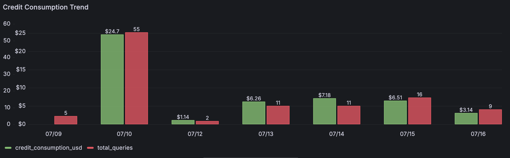
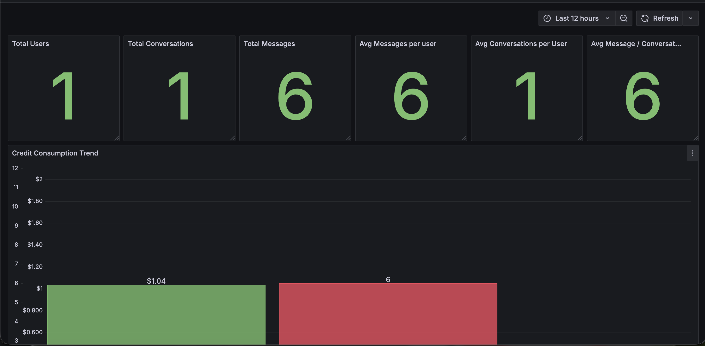
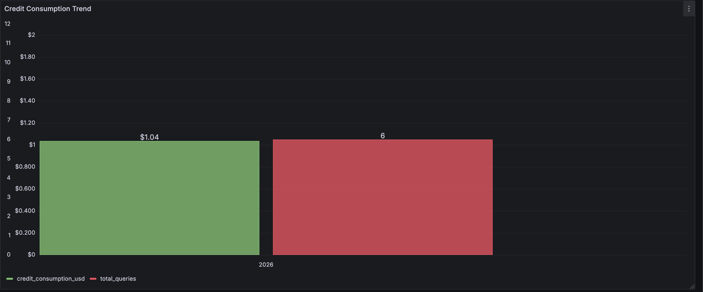

# Grafana Dashboards



Notes from building and iterating on an analytics dashboard in Grafana, backed by PostgreSQL.

---

## 1. Dashboard Structure

A typical usage-analytics dashboard has three layers:

- **KPI cards (Stat panels)** — single-number summaries: total users, total conversations, total queries, averages
- **Trend panels (Time series / Bar chart)** — a metric over time, usually cost or volume
- **Detail tables** — row-level logs for drill-down (a leaderboard, a raw activity log)

Grafana's global time-range picker doubles as the DAU/WAU/MAU control — no need for separate cards per window. Set the picker to "Last 1 day" / "Last 7 days" / "Last 30 days" and the same query answers all three.



---

## 2. Weighted Engagement Score

Normalize several metrics (0–1 scale against the max in the current window) and combine with weights:

```sql
ROUND(
  (0.40 * metric_a::numeric / NULLIF((SELECT MAX(metric_a) FROM stats), 0)) +
  (0.20 * metric_b::numeric / NULLIF((SELECT MAX(metric_b) FROM stats), 0)) +
  (0.15 * metric_c::numeric / NULLIF((SELECT MAX(metric_c) FROM stats), 0)) +
  (0.25 * metric_d::numeric / NULLIF((SELECT MAX(metric_d) FROM stats), 0))
, 3) AS engagement_score
```

If two weighted metrics are highly correlated (e.g. "total actions" and "total cost," where cost mostly follows action volume), the same signal ends up double-weighted. Worth a correlation check before trusting the weights.

---

## 3. Pairing Requests With Responses

If a message log stores every row (user + assistant) in one table with no explicit "reply-to" key, a `LATERAL` join finds the matching reply per request:

```sql
SELECT
  m.id,
  m.content AS request,
  resp.content AS response,
  resp.output_tokens
FROM messages m
LEFT JOIN LATERAL (
  SELECT a.content, a.output_tokens, a.created_at
  FROM messages a
  WHERE a.conversation_id = m.conversation_id
    AND a.role = 'assistant'
    AND a.created_at >= m.created_at
  ORDER BY a.created_at ASC
  LIMIT 1
) resp ON true
WHERE m.role = 'user';
```

A normal `JOIN` can't reference the outer row's columns inside its own subquery condition. `LATERAL` can — it re-runs the subquery once per outer row, which is what's needed to find "the next matching row after this one."

Alias convention that helps: outer alias (`m`) is the row being looked at, inner alias (`a`) is the set of candidate rows being searched, and the subquery name (`resp`) is the one matching candidate exposed to the outer query.

---

## 4. Timestamps Don't Always Mean What They Say

Computing response latency as `assistant_row.created_at - user_row.created_at` seemed reasonable. It wasn't.

Checked by picking one conversation and reading the raw rows directly, unrounded:

```sql
SELECT id, role, created_at, content
FROM messages
WHERE conversation_id = '<some id>'
ORDER BY created_at ASC;
```

A query that clearly required real work (large context, long generated output) showed a gap of ~4 milliseconds between the request row and its paired response row — not physically possible for real retrieval + generation.

Both rows were being written to the database after the full request/response cycle had already completed, likely in one batched insert once the reply was ready. So `created_at` reflected write time, not request or response time, and couldn't answer "how long did this take" regardless of how the query was written.

Before building any latency metric from timestamps, it's worth confirming with a few known-slow rows that the two timestamps actually move independently. If they're always a few milliseconds apart no matter how complex the operation was, they're stamped at the same logical moment, not real elapsed time. The actual fix is instrumentation captured at the moment of the event — a `request_received_at` set before processing starts and a `response_ready_at` set when generation finishes, populated by the application itself, not inferred from insert order after the fact.

---

## 5. NULL Values Can Have More Than One Cause

Some rows had NULL token counts. Initial assumption was one clean cause (e.g. cached responses skip token counting), until a counter-example showed a short/clarifying reply with real token counts — which ruled that theory out.

Worth grouping problem rows by characteristics (response type, size, time period) and checking whether the anomaly correlates with any of them, rather than settling on the first plausible explanation. NULLs that don't cluster by any obvious category point more toward an intermittent failure than a designed behavior.

Also worth separating:
- NULLs that are expected, e.g. a field wasn't captured before a certain date because the column didn't exist yet
- NULLs occurring within a period where the field should already be populated — this is the real anomaly worth chasing

---

## 6. Time Series Panels vs. Date-Only Data

Grouping by full calendar day (`created_at::date`, no time component) still gets rendered by a Time Series panel on a timezone-aware axis — Grafana converts UTC midnight to the viewer's local time, producing labels like `05:30:00` on every point instead of a clean date.

Switching the panel type to Bar Chart fixes this: it treats each date as a category label rather than a point on a continuous time scale, so there's no timezone conversion and exactly one bar per day with data.

```sql
SELECT
  created_at::date AS day,
  SUM(cost) AS total_cost,
  COUNT(*) AS total_events
FROM events
GROUP BY created_at::date
ORDER BY day;
```

Grouping by day only produces a row for days with matching data — days with zero activity don't show as $0, they're just missing. A line connecting two non-adjacent days can imply a smooth trend across a gap that was actually empty. To fill gaps explicitly:

```sql
SELECT
  d.day,
  COALESCE(SUM(e.cost), 0) AS total_cost
FROM generate_series(
  date_trunc('day', now() - interval '30 days'),
  date_trunc('day', now()),
  interval '1 day'
) AS d(day)
LEFT JOIN events e ON date_trunc('day', e.created_at) = d.day
GROUP BY d.day
ORDER BY d.day;
```

---

## 7. Auto-Interval Bucketing on Sparse Data

Grafana's `$__interval` variable auto-picks a bucket size aiming for roughly one point per pixel of panel width. On dense, evenly-distributed data this gives smooth resolution at any zoom level.

On sparse, bursty data, it can backfire — zoomed out to a week, Grafana might pick a bucket size of minutes, producing long empty stretches and jagged spikes wherever a burst landed. The traffic pattern is uneven and the bucket is too fine to smooth it.

For a stable, always-readable trend regardless of zoom, hardcode a fixed bucket (`'1d'`, `'12h'`, whatever fits the data density). For adaptive resolution with a floor, set a Min interval on the query (e.g. `1h`) so it never buckets finer than that.



---

## 8. Dual-Axis Overlays for Correlation Checks

A single metric line rarely explains why it moved. Overlaying a second, related metric on its own right-hand axis is a quick way to check correlation — e.g. does total cost track total volume, or does cost rise independently of volume.

```sql
SELECT
  created_at::date AS day,
  SUM(cost) AS total_cost,
  COUNT(*) FILTER (WHERE type = 'request') AS total_requests
FROM events
GROUP BY created_at::date
ORDER BY day;
```

In the panel's Field Overrides, add an override for the second series, set Axis → Placement → Right, and give it a distinct Unit so it isn't misread on the same scale as the first metric.

If both lines move in the same shape, the metric is likely just following volume. If they diverge, that's the signal worth investigating.

---

## 9. Filtering Out Internal Traffic

Deciding whether internal usage (testing, QA, demos) should be excluded from usage/cost metrics is worth doing early. If user identity lives in a separate lookup table, the filter needs the join chain in place first:

```sql
SELECT COUNT(*) 
FROM events e
JOIN sessions s ON s.id = e.session_id
LEFT JOIN user_profile up ON up.user_id = s.user_id
WHERE up.email NOT ILIKE '%@internal-domain.com';
```

Two details worth deciding explicitly:
1. `NOT ILIKE` is case-insensitive — use it over `NOT LIKE` so a differently-cased domain doesn't slip through.
2. Since the identity join is a `LEFT JOIN`, unmatched rows have `email IS NULL`, and `NULL NOT ILIKE '...'` evaluates to `NULL`, not `true` — so those rows get silently dropped by a plain `WHERE` filter. If unmatched rows should be kept, the condition needs to be explicit:
   ```sql
   AND (up.email IS NULL OR up.email NOT ILIKE '%@internal-domain.com')
   ```

---

## Summary

- Verify what a timestamp column actually captures before using it for durations — check raw rows against known-slow operations.
- Small sample sizes aren't reliable for spotting patterns — a handful of days or rows can't distinguish a real trend from noise.
- The first plausible explanation for an anomaly may not hold — look for counter-examples before settling on a cause.
- Panel type affects axis behavior as much as the query does — Time Series and Bar Chart handle date-only data differently, and picking the wrong one creates timezone artifacts.
- Adaptive settings like `$__interval` help on dense data and can hurt readability on sparse data — know when to hardcode instead.
- Joins added purely for filtering still need to handle the `LEFT JOIN` + `NULL` interaction, or rows meant to be kept get silently dropped.
